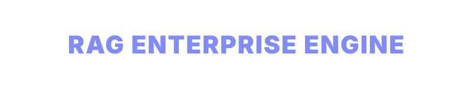

<div align="center">
  
</div>

<div align="center">
  
  
  
  
  
  
  
</div>

# RAG Enterprise Engine

An enterprise-ready Retrieval-Augmented Generation (RAG) system engineered for high-performance semantic search and AI interactions. The architecture implements a strict decoupling between a REST API backend (FastAPI) and a modern Glassmorphism frontend (Reflex), with complete Docker orchestration for scalable deployments.

## Architecture & Stack

- **Backend**: FastAPI, Uvicorn, LangChain, Google GenAI, Pydantic, FastEmbed
- **Frontend**: Reflex (Python Full-Stack Web Framework)
- **Vector Engine**: Qdrant (Rust-based semantic database)
- **Deployment**: Docker, Docker Compose
- **Dependency Management**: Poetry

## Key Capabilities

- **High-Speed Semantic Search**: Deep integration with Qdrant Vector Database utilizing HNSW indexing and Cosine distance metric for optimal meaning-based retrieval.
- **Multilingual Semantic Embeddings**: Utilizes the `paraphrase-multilingual-MiniLM-L12-v2` model via FastEmbed. This allows the system to seamlessly ingest and search PDFs and text across 50+ languages simultaneously (including English and Russian), projecting them into a unified semantic vector space without quality loss. The model weights are automatically downloaded directly from HuggingFace upon the very first container initialization.
- **LLM Integration**: Native support for Google Gemini (e.g., 3.7 Flash, 2.5 Pro) with strict context-binding to prevent hallucination.
- **Dynamic Ingestion Configuration**: Adjustable chunk sizes and overlapping windows configurable directly from the UI.
- **Docker-First Deployment**: Seamless environment bootstrapping via Docker Compose, eliminating host OS dependencies.

## Deployment Guide

### Requirements
- Docker Engine (v24.0+)
- Docker Compose (v2.20+)

### Setup Instructions

1. Configure the environment variables by creating a `.env` file in the repository root:
```text
GEMINI_API_KEY=your_google_gemini_api_key_here
```

2. Initialize and start the containerized services:
```bash
docker compose up --build -d
```

### Access Points

- **Web Interface**: [http://localhost:3000](http://localhost:3000)
- **API Documentation**: [http://localhost:8080/docs](http://localhost:8080/docs)

### Teardown

To stop the services and release bound ports (data persists in the local volume):
```bash
docker compose down
```

## Infrastructure Topology

1. `qdrant`: Official rust-compiled Qdrant vector database (port `6333`). Persists indexing data to `./data/qdrant_prod_storage`.
2. `backend`: FastAPI orchestration layer (port `8080`). Manages parsing, vector embedding generation, database communication, and AI synthesis.
3. `frontend`: Reflex application providing a Web UI (port `3000`) and WebSocket event server (port `8000`).
